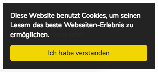

# Cookie Approval Plugin

A plugin for [Kirby 2 CMS](http://getkirby.com) that shows an cookie approval banner to use in your templates.



## Installation

Copy or link the `cookie` directory to `site/plugins/` **or** use the [Kirby CLI](https://github.com/getkirby/cli):

```
kirby plugin:install schnti/kirby-cookie
```

### Dependencies

[jQuery](https://jquery.com) v2.*+

### CSS (SCSS)
```SCSS
$ka-cookie-bg: #222 !default;
$ka-cookie-color: #fff !default;
$ka-cookie-link-color: #31a8f0 !default;
$ka-cookie-link-color-hover: #b2f7ff !default;
$ka-cookie-btn-bg: #f1d600 !default;
$ka-cookie-btn-color: #222 !default;
```

```SCSS
@import "../website/site/plugins/cookie/cookie.scss";
```

### Config Variables

**Tracking**
* ka.cookie.text: String (default: 'Diese Website benutzt Cookies, um seinen Lesern das beste Webseiten-Erlebnis zu ermöglichen.')
* ka.cookie.linkText: String (default: '/datenschutzerklaerung')
* ka.cookie.link: String (default: 'Mehr Infos')
* ka.cookie.buttonText: String (default: 'Ich habe verstanden')


```php
c::set('ka.cookie.text', 'This website uses cookies to ensure you get the best experience on our website.');
c::set('ka.cookie.linkText', 'More info');
c::set('ka.cookie.link', '/privacy');
c::set('ka.cookie.buttonText', 'Got It!');
```

## How to use it

use this right before closing `</body>` tag and after jQuery import

```php
<script src="http://ajax.googleapis.com/ajax/libs/jquery/2.1.4/jquery.min.js"></script>

<?= cookie(); ?>
```